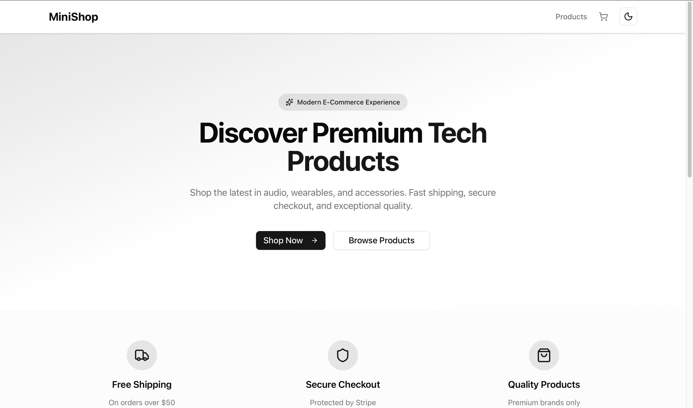

# 🛍️ MiniShop - Modern E-Commerce Platform

<div align="center">

# 🛍️ MiniShop - Modern E-Commerce Platform

**A sleek e-commerce platform showcasing modern web technologies with seamless shopping experience and secure payments**

[](https://github.com/emreyn1/minishop)
[](https://github.com/emreyn1/minishop/fork)
[](https://github.com/emreyn1/minishop)

[](https://nextjs.org/)
[](https://react.dev/)
[](https://www.typescriptlang.org/)
[](https://tailwindcss.com/)
[](https://stripe.com/)
[](LICENSE)

[Features](#-features) • [Demo](#-demo) • [Tech Stack](#-tech-stack) • [Screenshots](#-screenshots) • [Getting Started](#-getting-started)

**⭐ Star this repo if you find it useful!**

  </div>

---

## 📸 Screenshots

   <div align="center">

### Homepage

*Modern hero section with premium tech products and seamless shopping experience*

</div>

---

## ✨ Features

### 🛍️ Product Discovery
- **Premium Product Catalog**: Curated selection of high-end tech products (Audio, Wearables, Accessories, Monitors)
- **Advanced Search**: Real-time product search with instant results
- **Smart Filtering**: Category-based filtering with smooth animations
- **Product Showcase**: Beautiful product cards with hover effects and image optimization
- **Responsive Grid**: Adaptive layout that works perfectly on all devices

### 🛒 Intelligent Shopping Cart
- **Persistent Cart**: Smart localStorage implementation keeps your cart across sessions
- **Quantity Management**: Intuitive plus/minus controls with real-time updates
- **Dynamic Pricing**: Live total calculation with shipping information
- **Cart Persistence**: Never lose your items - cart survives browser refreshes
- **Empty State Design**: Helpful guidance when cart is empty

### 💳 Secure Payment Processing
- **Stripe Integration**: Enterprise-grade payment processing with Stripe Checkout
- **Secure Checkout**: PCI-compliant payment flow with fraud protection
- **Payment Status**: Real-time feedback for successful and canceled payments
- **Error Handling**: Comprehensive error handling with user-friendly messages
- **Checkout Recovery**: Smart handling of payment interruptions

### 🎨 Modern User Experience
- **Dark/Light Mode**: Seamless theme switching with preference persistence
- **Glassmorphism Design**: Modern frosted glass effects and gradient backgrounds
- **Smooth Animations**: Polished transitions and micro-interactions
- **Mobile-First**: Optimized experience across all screen sizes
- **Accessibility**: WCAG-compliant design with keyboard navigation

### ⚡ Performance & Security
- **Next.js 15**: Latest App Router with React Server Components
- **Optimized Images**: Automatic image optimization and lazy loading
- **Type Safety**: Full TypeScript coverage with strict type checking
- **Modern Stack**: React 19 with concurrent features and automatic batching
- **Security First**: Secure payment handling and input validation

---

## 🛠️ Tech Stack

- **Framework**: [Next.js 15](https://nextjs.org/) (App Router)
- **UI Library**: [React 19](https://react.dev/)
- **Styling**: [Tailwind CSS 4.0](https://tailwindcss.com/)
- **Payment**: [Stripe](https://stripe.com/) (Checkout & API)
- **UI Components**: [ShadCN UI](https://ui.shadcn.com/) + [Radix UI](https://www.radix-ui.com/)
- **Icons**: [Lucide React](https://lucide.dev/)
- **Type Safety**: [TypeScript 5](https://www.typescriptlang.org/)
- **State Management**: React Context API + localStorage
- **Image Optimization**: Next.js Image Component

---

## 🌐 Demo

**Live Demo**: [Visit MiniShop](https://e-commercet.vercel.app)

> **Note**: Make sure to set up Stripe environment variables for the payment functionality to work properly.

---

## 🏗️ Architecture Overview

This application is built with a modern, scalable architecture:

- **Frontend**: Next.js 15 with App Router, React 19 Server Components, TypeScript
- **Backend**: Next.js API Routes (serverless functions)
- **Payment**: Stripe Checkout integration with webhook support
- **State Management**: React Context with localStorage persistence
- **Styling**: Tailwind CSS with custom design system and dark mode
- **Deployment**: Optimized for Vercel with automatic scaling

---

## 🚀 Getting Started

### Prerequisites

Make sure you have the following installed:

- **Node.js** 18.x or higher ([Download](https://nodejs.org/))
- **npm** 10.x or higher (comes with Node.js)
- **Git** ([Download](https://git-scm.com/))

### Installation

1. **Clone the repository**

```bash
git clone https://github.com/emreyn1/minishop.git
cd minishop
```

2. **Install dependencies**

```bash
npm install
```

3. **Set up environment variables**

Create a `.env.local` file in the root directory:

```env
# Stripe Configuration
NEXT_PUBLIC_STRIPE_PUBLISHABLE_KEY=pk_test_your_stripe_publishable_key_here
STRIPE_SECRET_KEY=sk_test_your_stripe_secret_key_here

# Optional: For production deployment
STRIPE_WEBHOOK_SECRET=whsec_your_webhook_secret_here
```

4. **Set up Stripe**

- Create a [Stripe](https://stripe.com) account
- Get your test API keys from the Stripe Dashboard
- Add them to your `.env.local` file

5. **Run the development server**

```bash
npm run dev
```

Open [http://localhost:3000](http://localhost:3000) in your browser to view the application.

### Environment Variables Setup

For detailed instructions on setting up Stripe:

- 📄 [Stripe Setup Guide](./STRIPE_SETUP.md)
- 🔧 [Environment Variables](./ENV_FIX.md)

---

## 🎯 How to Use

### Getting Started

1. **Browse Products**: Explore our curated selection of premium tech products
2. **Search & Filter**: Use the search bar or category filters to find specific items
3. **Add to Cart**: Click "Add to Cart" on any product to start shopping
4. **Manage Cart**: View, update quantities, or remove items from your cart
5. **Checkout**: Secure payment processing with Stripe Checkout
6. **Confirmation**: Receive instant payment confirmation

### Key Features

- **Product Discovery**: Browse by categories (Audio, Wearables, Accessories, Monitors)
- **Smart Search**: Find products instantly with real-time search
- **Cart Management**: Add, remove, and update quantities with visual feedback
- **Secure Payments**: Stripe-powered checkout with multiple payment methods
- **Theme Switching**: Toggle between light and dark modes
- **Mobile Shopping**: Optimized experience on all devices

---

## 🚀 Performance

- **Fast Loading**: Optimized bundle size with code splitting and lazy loading
- **Server Components**: React Server Components for better performance
- **Image Optimization**: Automatic image optimization and WebP conversion
- **Caching Strategy**: Intelligent caching for improved user experience
- **Type Safety**: Full TypeScript support for reliability
- **Error Boundaries**: Comprehensive error handling and recovery

---

## 🔒 Security Features

- ✅ **Stripe PCI Compliance**: Enterprise-grade payment security
- ✅ **Input Validation**: Form validation and sanitization
- ✅ **Error Handling**: Comprehensive error handling with user-friendly messages
- ✅ **Type Safety**: Full TypeScript support for secure development
- ✅ **Environment Variables**: Secure handling of sensitive payment data
- ✅ **HTTPS Only**: Secure connections for all payment operations

---

## 📁 Project Structure

```
minishop/
├── app/                          # Next.js App Router
│   ├── api/                      # API routes
│   │   └── checkout/            # Stripe checkout endpoint
│   ├── cart/                    # Shopping cart page
│   ├── products/                # Products catalog page
│   ├── layout.tsx               # Root layout with providers
│   ├── page.tsx                 # Homepage with hero section
│   └── globals.css              # Global styles and themes
├── components/                   # React components
│   ├── ui/                      # ShadCN UI components
│   ├── Navbar.tsx               # Navigation with cart indicator
│   ├── ProductCard.tsx          # Product display card
│   └── footer.tsx               # Site footer
├── context/                      # React Context providers
│   └── CartContext.tsx          # Shopping cart state management
├── lib/                         # Utility libraries
│   ├── products.ts              # Product data and types
│   ├── stripe.ts                # Stripe configuration
│   └── utils.ts                 # Helper functions
├── public/                       # Static assets
│   └── screenshots/             # Project screenshots
├── next.config.ts               # Next.js configuration
├── tailwind.config.js           # Tailwind CSS configuration
├── tsconfig.json                # TypeScript configuration
└── package.json                 # Dependencies and scripts
```

---

## 🧪 Development

### Available Scripts

```bash
# Development server
npm run dev

# Development with Turbopack
npm run dev:turbo

# Production build
npm run build

# Start production server
npm start

# Lint code
npm run lint
```

### Development Features

- **Hot Reload**: Instant updates during development
- **Type Checking**: Real-time TypeScript error checking
- **ESLint**: Code quality and consistency checks
- **Turbopack**: Fast refresh and bundling (experimental)

---

## 🚀 Deployment

### Deploy to Vercel (Recommended)

The easiest way to deploy this Next.js app is using [Vercel](https://vercel.com):

1. **Push your code to GitHub**

```bash
git add .
git commit -m "Ready for deployment"
git push origin main
```

2. **Import to Vercel**
   - Go to [Vercel Dashboard](https://vercel.com/dashboard)
   - Click "Add New Project"
   - Import your GitHub repository
   - Configure project settings:
     - **Framework Preset:** Next.js
     - **Build Command:** `npm run build`
     - **Output Directory:** (leave empty)

3. **Add Environment Variables**
   - Add all environment variables from your `.env.local` file
   - Make sure to add them for all environments (Production, Preview, Development)

4. **Configure Stripe Webhooks** (Optional)
   - Set up Stripe webhooks for production order fulfillment
   - Add webhook endpoint URL to Stripe Dashboard

5. **Deploy!**
   - Click "Deploy"
   - Wait for the build to complete
   - Your app will be live at `https://your-project.vercel.app`

### Environment Variables on Vercel

For detailed Vercel deployment instructions:

- 📄 [Vercel Deployment Guide](./VERCEL_DEPLOYMENT.md)
- 🔧 [Stripe Webhook Setup](./STRIPE_WEBHOOKS.md)

---

## 📝 Important Notes

- **Stripe Setup**: You need both publishable and secret keys for payments to work
- **Environment Variables**: All Stripe keys must be set for the application to function
- **Test Mode**: Use Stripe test keys for development and testing
- **Production**: Switch to live keys when deploying to production
- **Webhooks**: Optional but recommended for production order processing

---

## 🔒 Privacy & Security

- ✅ **Secure Payments**: Stripe handles all payment data securely
- ✅ **No Data Storage**: No sensitive customer data stored locally
- ✅ **HTTPS Required**: All connections secured with SSL/TLS
- ✅ **Input Sanitization**: All user inputs are validated and sanitized
- ✅ **Error Handling**: Secure error messages that don't expose sensitive data

---

## 🤝 Contributing

Contributions are welcome! Please feel free to submit a Pull Request.

1. Fork the repository
2. Create your feature branch (`git checkout -b feature/AmazingFeature`)
3. Commit your changes (`git commit -m 'Add some AmazingFeature'`)
4. Push to the branch (`git push origin feature/AmazingFeature`)
5. Open a Pull Request

---

## 📄 License

This project is open source and available under the [MIT License](LICENSE).

---

## 🙏 Acknowledgments

Built with amazing open-source technologies:

- [Next.js](https://nextjs.org/) - The React Framework
- [React](https://react.dev/) - UI Library
- [Stripe](https://stripe.com/) - Payment Processing
- [Tailwind CSS](https://tailwindcss.com/) - Styling Framework
- [TypeScript](https://www.typescriptlang.org/) - Type Safety
- [ShadCN UI](https://ui.shadcn.com/) - UI Components
- [Lucide](https://lucide.dev/) - Beautiful Icons

---

<div align="center">

## ⭐ Like this project? Give it a star!

[](https://star-history.com/#emreyn1/minishop&Date)

**Star this repo to show your support!** ⭐

---

**Built with ❤️ using Next.js, React, and TypeScript**

[Features](#-features) • [Demo](#-demo) • [Getting Started](#-getting-started) • [License](#-license)

</div>
